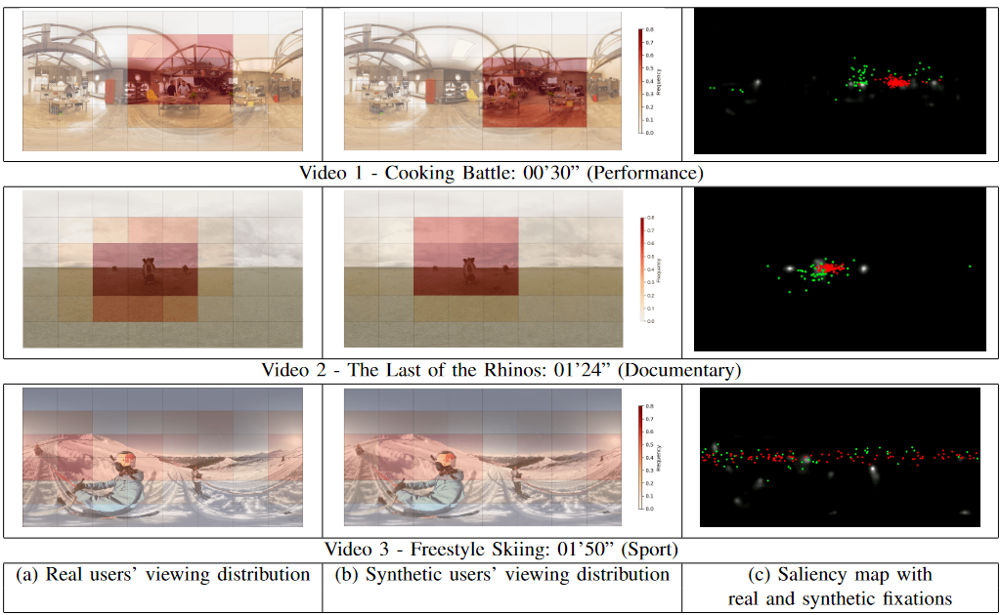
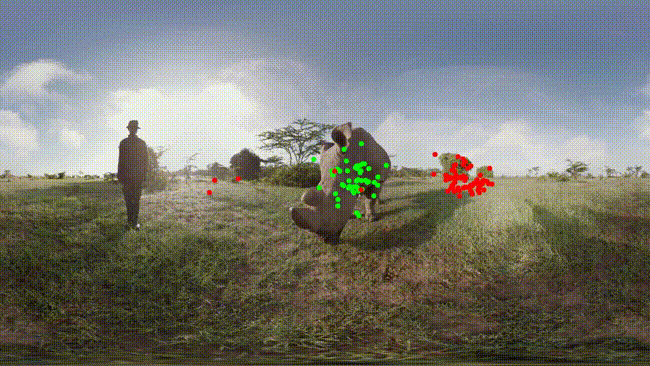

# Modeling Users’ Behavior in 360-Degree Videos: A Framework for Synthetic Data Generation

The surge in popularity of 360° video streaming has driven the need for optimization models to ensure a seamless viewing experience. However, existing datasets for training and testing such models are limited in both user diversity and video duration. Traditional data collection methods are time-consuming and raise privacy concerns. To address this scarcity, we propose a novel approach: generating synthetic 360° video viewing data. By modeling user fixation points as autonomous agents within a saliency map environment, our approach overcomes the data limitations. We present in this repository the implementation details and the results obtained in the paper for reproducibility, we demonstrate the steps for tailored dataset generation.

# Requirements
- Python>=3.9
- opencv >=4.9
- seaborn>=0.11.2
- scipy>=1.9.1
- pandas
- numpy
- matplotlib

# Structure
- `sensor_projection_utils.py` : coordinates projection and convertion utils
- `video_viewing_simulation.ipynb` : main implementation, `simulation` function takes the saliency environment video and the parameters of the heuristic to generate a trajectory of head movements, output get saved as a csv. `simulation_visualization` function to visualize user fixation and the FoV through a video viewing experience. 
- `results_validation.ipynb` : an analysis for synthetic users, comparison of fixations,FoV,Movements between real and synthetic and real users. code to reproduce figures in the paper.

# Saliency environment
To create the environment for our model, we use the saliency map from [EML-NET-Saliency](https://arxiv.org/abs/1805.01047) research paper, because of its lightness and accuracy in highlighting the regions of interest (ROI). In our experimentation we generated saliency videos based on following implementation [EML-NET-Saliency Implementation](https://github.com/SenJia/EML-NET-Saliency)

# Demo
.

Green points represents  48 real users head fixations from dataset presented in [dataset](https://wuchlei-thu.github.io/) , Red points represents synthetic generated users with our approach. 
for full generated video (https://www.youtube.com/watch?v=OjzbImTvgNQ).
we share the data generated for the 3 samples videos in the following link () 